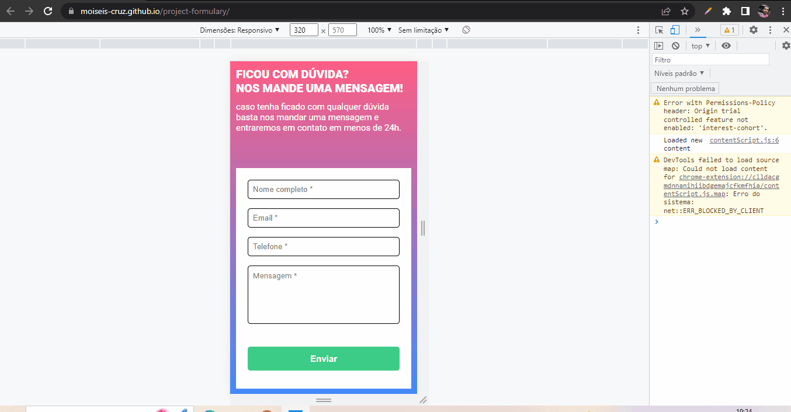

# project-formulary

Desafio proposto pelo curso DevQuest onde ponho a prova os meus conhecimentos com as linguagens estudadas até então.

## linguagens utilizadas:

- HTML;
- CSS;
- Javascript (JS);

